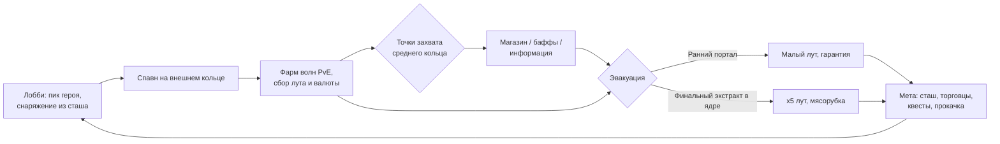

# ADR-001. Концепт игры «Кольцо» (рабочее название)

**Статус:** принят
**Дата:** 2026-07-31
**Жанр:** PvEvP extraction-арена с MOBA-элементами, топ-даун ¾
**Целевой формат:** 3 отряда × 3 игрока на матч. **MVP-формат:** 3 игрока (соло, FFA).

---

## 1. Видение

Сессионный extraction на компактной кольцевой арене. Игрок заходит с героем и снаряжением,
фармит PvE, собирает билд внутри матча, конфликтует за точки захвата и выносит лут через
порталы эвакуации. Смерть = потеря внесённого и нафармленного. Между матчами — таркововская
метапрогрессия: сташ, торговцы, квесты, хайдаут.

Ключевая формула: **петля Tarkov/Arc Raiders + плотность боя Crimsonland + тактика MOBA**.

Референсы: Escape from Tarkov (экономика, ставки), Arc Raiders (PvEvE-давление среды),
Battlerite (боёвка, перспектива), Vampire Survivors (внутриматчевый билд из дропа),
Dark and Darker (extraction без огромной карты).

## 2. Ядро петли

Смерть в матче → потеря внесённого снаряжения (кроме застрахованного) и всего нафармленного.

## 3. Арена

Круглая карта из трёх концентрических зон. Давление волн PvE нарастает от края к центру
и по времени матча — арена выталкивает игроков в конфликт.

| Зона | Контент | Риск | Лут |
|---|---|---|---|
| Внешнее кольцо | Спавн-порталы, слабые мобы, ранние эвакуации | Низкий | Базовый |
| Среднее кольцо | Элитные мобы, точки захвата | Средний | Хороший |
| Ядро | Босс-волны, финальный экстракт | Максимальный | x5 |

Правила зон:

- Спавн-порталы разнесены по краю, минимальная дистанция между отрядами при спавне.
- Ранние порталы эвакуации открываются волнами по таймеру (например, на 5-й и 10-й минуте,
  окно 60 сек). Выход — гарантированный, но лут ограничен тем, что успел собрать.
- Финальный экстракт в ядре открывается на последних минутах матча. Открытие объявляется всем.
- Стены и препятствия блокируют снаряды **и видимость** (fog of war считается сервером).

## 4. Формат матча

- Длительность: 15–20 минут жёсткого таймера. Не эвакуировался — погиб (сжатие зоны не нужно,
  давление создают волны и таймер).
- MVP: 3 игрока соло, FFA. Целевой формат: 3 отряда × 3 (полные пачки, friendly fire off).
- Убийство игрока → выпадает часть его сумки (нафармленное в матче) + внесённое снаряжение
  по правилам страховки.

## 5. Герои

На старте 3 героя, глубина важнее количества. Герой задаёт **способности**;
оружие и предметы — из лута и магазина.

| Герой (роль) | Профиль |
|---|---|
| Бруталь / танк | Ближний-средний бой, контроль пространства, инициация |
| Стрелок | Дистанция, снаряды с упреждением, высокий DPS, низкая живучесть |
| Оператор / саппорт | Контроль, разведка, поддержка, слабый прямой урон |

Кит героя: 2 активные способности + дэш (общая механика, у героев — вариации) + ульта.
Все способности — server-authoritative, клиент предсказывает только движение и косметику.

**Ульта заряжается фармом**: убийства мобов и захваты точек, не время. Следствие — два
легитимных темпа: «жадный фарм → приход в ядро с ультами» против «раш центра голыми, но раньше».

## 6. Точки захвата (среднее кольцо)

Захват любой точки **объявляется всем игрокам** с указанием точки — это двигатель конфликта.

| Точка | Награда владельцу | Двигатель конфликта |
|---|---|---|
| Реле | Позиции игроков сектора на миникарте на N сек | Информация — все хотят её отнять |
| Алтарь | Глобальный бафф + ускорение заряда ульты в радиусе | Усиление видно по игрокам |
| Кузня | Магазин: владелец покупает со скидкой, чужие — по полной | Экономическое преимущество |

Механика захвата: канал на точке (прерывается уроном), state-машина на сервере:
`нейтральна → захватывается(команда, прогресс) → захвачена(команда) → оспаривается`.
MVP включает **только реле** — самая дешёвая реализация, самый сильный эмоциональный эффект
(«нас видят»).

## 7. Билдостроение

Три слоя силы игрока:

1. **До матча:** пик героя + внесённое снаряжение из сташа (оружие, расходники).
2. **В матче:** дроп с мобов (модификаторы в духе VS: скорострельность, снаряды, вампиризм)
   + покупки в кузне за валюту матча.
3. **Мета:** прокачка героя/хайдаута между матчами (разблокировки, не голые статы).

### Power budget (правило баланса)

Внесённое снаряжение ограничено слот-лимитом (gear score cap). Основную дельту силы в матче
даёт заработанное **внутри** матча. Цель: исключить сценарий «богатый в мете односторонне
убивает бедного» (болезнь Таркова).

## 8. Метапрогрессия

- Персистентный сташ (ограниченный объём, апгрейдится).
- Торговцы: 2–3 NPC с уровнями лояльности, квестами («захвати реле 3 раза», «вынеси предмет X
  из ядра») и ассортиментом.
- Страховка: внесённое снаряжение возвращается с шансом/задержкой, если его не вынес убийца.
- Хайдаут: пассивные бонусы (крафт расходников, скорость страховки). Пост-MVP.
- Вайпы как сезоны. Пост-MVP.

## 9. Перспектива и боёвка

- **Топ-даун ¾ на 3D-рендере** (камера 50–60°). Симуляция плоская (2D-физика в 3D-мире).
- **Все выстрелы — физические снаряды** с временем полёта. Хитсканов нет. Уклонение — скилл,
  упреждение — скилл, и это же радикально упрощает неткод (см. ADR-002 §5).
- Мувмент: моментум (разгон/торможение), дэш с i-frames и кулдауном, отдача смещает прицел.
- Line of sight: стены блокируют снаряды и видимость; fog of war — серверный.

## 10. Визуальный стиль

Мрачный неон: тёмная среда + эмиссивные снаряды/способности. Ближе к Darktide, чем к
мультяшности. Ассеты — лоуполи-паки (Synty/Kenney), картинку тащат свет и VFX.

Game-feel-чеклист на каждое попадание (обязателен, не опционален): hitstop 30–50 мс,
вспышка шейдера цели, микротряска камеры, партикль, звук с рандомизацией питча.
Трейсеры, гильзы, декали и трупы не исчезают до конца матча.

## 11. Что осознанно НЕ делаем

- Открытый мир, большие карты, выживание (голод/жажда/крафт баз).
- Хитскан-оружие.
- Больше 3 героев до подтверждения петли.
- Клиентские решения по урону/луту/захватам — никогда.
- F2P-монетизация на этапе прототипа — не думаем вообще.

## 12. Критерий успеха концепта

Плейтест MVP с живыми игроками: момент «слышу, что реле захватили — значит нас видят»
вызывает реакцию, игроки просят вторую катку. Если нет — итерируем петлю, не наращиваем контент.
