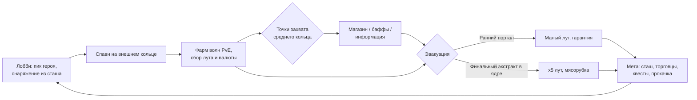

# ADR-001. Концепт игры «Кольцо» (рабочее название)

**Статус:** принят
**Дата:** 2026-07-31
**Жанр:** PvEvP extraction-арена с MOBA-элементами, топ-даун ¾
**Целевой формат:** 3 отряда × 3 игрока на матч. **MVP-формат:** 3 игрока (соло, FFA).

---

## 1. Видение

Сессионный extraction на компактной кольцевой арене. Игрок заходит с героем и снаряжением,
фармит PvE, собирает билд внутри матча, конфликтует за точки захвата и выносит лут через
порталы эвакуации. Смерть = потеря внесённого и нафармленного. Между матчами — таркововская
метапрогрессия: сташ, торговцы, квесты, хайдаут.

Ключевая формула: **петля Tarkov/Arc Raiders + плотность боя Crimsonland + тактика MOBA**.

Референсы: Escape from Tarkov (экономика, ставки), Arc Raiders (PvEvE-давление среды),
Battlerite (боёвка, перспектива), Vampire Survivors (внутриматчевый билд из дропа),
Dark and Darker (extraction без огромной карты).

## 2. Ядро петли

Смерть в матче → потеря внесённого снаряжения (кроме застрахованного) и всего нафармленного.

## 3. Арена

Круглая карта из трёх концентрических зон. Важно: **мобы не заталкивают игроков к центру
физически** — движение внутрь создаётся экономикой времени (см. §3.1).

| Зона | Контент | Риск | Лут |
|---|---|---|---|
| Внешнее кольцо | Спавн-порталы, слабые мобы, ранние эвакуации | Низкий → растёт со временем | Базовый, всегда |
| Среднее кольцо | Элитные мобы, точки захвата | Средний | Хороший |
| Ядро | Босс + свита, финальный экстракт | Максимальный | x5 |

### 3.1. Темп матча: часы тревоги

Три силы, ни одна не толкает в спину — игрок всегда решает сам:

1. **Часы тревоги (push через время).** Уровень тревоги объекта растёт по таймеру матча:
   хозяин осознаёт вторжение. Каждая волна **везде** сильнее предыдущей, но лут и XP
   внешнего кольца остаются базовыми. Внешнее кольцо со временем превращается из
   «безопасно и выгодно» в «опасно и невыгодно»: на 12-й минуте на периферии дерёшься
   с мобами среднего уровня за мусорный дроп. Сложность привязана к часам,
   ценность — к месту (модель Risk of Rain).
2. **Истощение.** Волны в уже зачищенном секторе дают убывающий дроп (лорно: хозяин
   перераспределяет производственные мощности вглубь). Бесконечный фарм у спавна
   перестаёт быть оптимальным математически, а не запрещается правилом.
3. **Притяжение (pull).** Всё желаемое — внутрь: жирный лут и элитки среднего кольца,
   точки захвата, ускоренный заряд ульты у энергоузла, Директор и створ. Центр платит
   за присутствие, а не наказывает за отсутствие.

**Ритм волн — циклы, не поток:** анонс хозяина («фабрикация партии начата») → волна →
окно тишины 60–90 сек. Окна — легальное время на лут, раскидку поинтов (§7), канал захвата
точки, дорогу до раннего портала. Ранний выход — решение «ухожу в окно между волнами»;
замешкался — эвакуируешься под волной, что честно и напряжённо.

Правила зон:

- Спавн-порталы разнесены по краю, минимальная дистанция между отрядами при спавне.
- Ранние порталы эвакуации открываются волнами по таймеру (например, на 5-й и 10-й минуте,
  окно 60 сек). Выход — гарантированный, но лут ограничен тем, что успел собрать.
- Босс активируется в ядре на последних минутах матча (объявляется всем). Финальный
  экстракт открывается **смертью босса** с задержкой ~90 сек: убийцы получают лут и окно
  на дележ/предательство до открытия створа. Не убили босса до конца таймера — финального
  выхода нет, остаются только уже закрытые ранние порталы (то есть никто не вышел с топ-лутом).
- Стены и препятствия блокируют снаряды **и видимость** (fog of war считается сервером).

## 4. Формат матча

- Длительность: 15–20 минут жёсткого таймера. Не эвакуировался — погиб (сжатие зоны не нужно,
  давление создают волны и таймер).
- MVP: 3 игрока соло, FFA. Целевой формат: 3 отряда × 3 (полные пачки, friendly fire off).
- Убийство игрока → выпадает часть его сумки (нафармленное в матче) + внесённое снаряжение
  по правилам страховки.

### 4.1. Социальная динамика (принцип Arc Raiders)

Игроки на карте — не команды по умолчанию. Конфликт, временный альянс против босса,
сговор двое-против-одного и предательство при дележе — **всё легально**. Игра это
не поощряет и не запрещает: никаких механик репутации предателя, штрафов за огонь по
недавнему союзнику, формальных «пактов». Дипломатия — целиком эмерджентная.

Что игра для этого даёт (и только это):

- **Босс, сбалансированный на 2–3 игроков.** Соло-убийство возможно, но требует топ-снаряжения
  и мастерства — экономическое давление к временным альянсам.
- **Проксимити-войс (обязателен в MVP):** открытый голосовой эфир ближнего радиуса
  с позиционным звуком и затуханием. Слышат все в радиусе — и союзники, и жертвы:
  подслушать чужой сговор — легитимная разведка. Мёртвые не говорят (целостность информации).
- **Короткие фразы (обязательны в MVP):** радиальное меню готовых реплик, транслируются
  голосом в том же прокси-радиусе + дублируются пингом. Минимальный набор: «Не стреляю»,
  «Мир?», «Босс — вместе?», «Делим и расходимся», «Уходи», «Помоги», «Сзади!», «Спасибо».
  Это язык переговоров для тех, кто без микрофона — без него безмикрофонный игрок
  выпадает из социальной петли.
- Пинги по миру (метки лута/опасности/направления).
- **Лут босса разделён физически:** несколько контейнеров, раскиданных по арене ядра,
  плюс **один** уникальный предмет (главная ценность). Контейнеры можно молча разобрать
  по одному на брата; уникальный предмет — точка неизбежного решения: делим по-хорошему
  не получится.
- **Окно напряжения:** 90 сек между смертью босса и открытием створа. Достаточно, чтобы
  залутаться и разойтись — или нет.

Правило дизайна: любые будущие механики проверяются на вопрос «убивает ли это неопределённость
момента дележа?» Если да — механика отклоняется.

## 5. Герои

На старте 3 героя, глубина важнее количества. Герой задаёт **способности**;
оружие и предметы — из лута и магазина.

| Герой (роль) | Профиль |
|---|---|
| Бруталь / танк | Ближний-средний бой, контроль пространства, инициация |
| Стрелок | Дистанция, снаряды с упреждением, высокий DPS, низкая живучесть |
| Оператор / саппорт | Контроль, разведка, поддержка, слабый прямой урон |

Кит героя: 2 активные способности + дэш (общая механика, у героев — вариации) + ульта.
Все способности — server-authoritative, клиент предсказывает только движение и косметику.

**Ульта заряжается фармом**: убийства мобов и захваты точек, не время. Следствие — два
легитимных темпа: «жадный фарм → приход в ядро с ультами» против «раш центра голыми, но раньше».

## 6. Точки захвата (среднее кольцо)

Захват любой точки **объявляется всем игрокам** с указанием точки — это двигатель конфликта.

| Точка | Награда владельцу | Двигатель конфликта |
|---|---|---|
| Реле | Позиции игроков сектора на миникарте на N сек | Информация — все хотят её отнять |
| Энергоузел | Глобальный бафф + ускорение заряда ульты в радиусе | Усиление видно по игрокам |
| Фабрикатор | Магазин: владелец покупает со скидкой, чужие — по полной | Экономическое преимущество |

Механика захвата: канал на точке (прерывается уроном), state-машина на сервере:
`нейтральна → захватывается(команда, прогресс) → захвачена(команда) → оспаривается`.
MVP включает **только реле** — самая дешёвая реализация, самый сильный эмоциональный эффект
(«нас видят»).

## 7. Билдостроение

Три слоя силы игрока:

1. **До матча:** пик героя + внесённое снаряжение из сташа (оружие, расходники).
2. **В матче:** уровни носителя (§7.1) + дроп с мобов + покупки в фабрикаторе за валюту матча.
3. **Мета:** прокачка героя/хайдаута между матчами (разблокировки, не голые статы).

### 7.1. Внутриматчевые уровни носителя

XP за убийства и захваты → уровень оболочки → **поинт**. Трата поинта — выбор из
**3 предложенных вариантов** (модель VS/Risk of Rain: карточка = модификатор: скорострельность,
доп. снаряд, вампиризм, ёмкость щита, скорость перегруза...). Правила:

- Выбор занимает секунды и делается в окне тишины между волнами (§3.1) — никаких деревьев
  талантов посреди боя; окно выбора не ставит игру на паузу (мультиплеер).
- Нераскиданный поинт копится, но не даёт ничего — стимул решать.
- Уровни сгорают с концом матча полностью: это сила цикла, не меты.
- Пул вариантов зависит от героя (пересекающийся общий пул + фирменные карточки кита).

### Power budget (правило баланса)

Внесённое снаряжение ограничено слот-лимитом (gear score cap). Основную дельту силы в матче
даёт заработанное **внутри** матча. Цель: исключить сценарий «богатый в мете односторонне
убивает бедного» (болезнь Таркова).

## 8. Метапрогрессия

- Персистентный сташ (ограниченный объём, апгрейдится).
- Торговцы: 2–3 NPC с уровнями лояльности, квестами («захвати реле 3 раза», «вынеси предмет X
  из ядра») и ассортиментом.
- Страховка: внесённое снаряжение возвращается с шансом/задержкой, если его не вынес убийца.
- Хайдаут: пассивные бонусы (крафт расходников, скорость страховки). Пост-MVP.
- Вайпы как сезоны. Пост-MVP.

## 9. Перспектива и боёвка

- **Топ-даун ¾ на 3D-рендере** (камера 50–60°). Симуляция плоская (2D-физика в 3D-мире).
- **Все выстрелы — физические снаряды** с временем полёта. Хитсканов нет. Уклонение — скилл,
  упреждение — скилл, и это же радикально упрощает неткод (см. ADR-002 §5).
- Мувмент: моментум (разгон/торможение), дэш с i-frames и кулдауном, отдача смещает прицел.
- Line of sight: стены блокируют снаряды и видимость; fog of war — серверный.

## 10. Визуальный стиль

Мрачный неон: тёмная среда + эмиссивные снаряды/способности. Ближе к Darktide, чем к
мультяшности. Ассеты — лоуполи-паки (Synty/Kenney), картинку тащат свет и VFX.

Game-feel-чеклист на каждое попадание (обязателен, не опционален): hitstop 30–50 мс,
вспышка шейдера цели, микротряска камеры, партикль, звук с рандомизацией питча.
Трейсеры, гильзы, декали и трупы не исчезают до конца матча.

## 11. Что осознанно НЕ делаем

- Открытый мир, большие карты, выживание (голод/жажда/крафт баз).
- Хитскан-оружие.
- Больше 3 героев до подтверждения петли.
- Клиентские решения по урону/луту/захватам — никогда.
- F2P-монетизация на этапе прототипа — не думаем вообще.

## 12. Реиграбельность

Источники, по убыванию мощности:

1. **Люди.** Каждый матч другой, потому что другие — живые игроки с непредсказуемой
   дипломатией (§4.1). Дележ у трупа Директора — генератор историй; истории — главная
   валюта реиграбельности extraction-жанра.
2. **Экономика меты.** Цикл «заработал → вложил → рискнул → потерял → отстроился»
   (Мул как пол падения) + квесты фракций как цель каждого захода.
3. **Билд-пространство.** Герой × аугменты носителя × внутриматчевые поинты (§7.1) × RNG
   дропа и карточек.
4. **Перестройка объекта.** Хозяин пересобирает «Венец-9» между циклами — буквально:
   при фиксированной кольцевой геометрии от seed варьируются расположение точек и порталов,
   модульные стены секторов, состав волн, плюс 1–2 **директивы цикла** — модификаторы матча
   (см. ADR-003).

Честная оценка: одна арена и три героя — мало контента, MVP держится на пунктах 1–2.
Критерий §13 проверяет именно это: тащат ли ставки и люди без контента. Тащат — контент
доливается спокойно; нет — объём контента не спасёт, и узнать это надо на грейбоксе.

## 13. Критерий успеха концепта

Плейтест MVP с живыми игроками: момент «слышу, что реле захватили — значит нас видят»
вызывает реакцию, игроки просят вторую катку. Если нет — итерируем петлю, не наращиваем контент.

## 14. Amendments

Поправки владельца к принятому концепту. Исходный текст выше не редактируется;
при конфликте действует amendment.

- **A1 (2026-08-03).** Боёвка-глубина (эпик `app-n6g`, спека
  `docs/superpowers/specs/2026-08-03-combat-depth-spec.md`) — уточняет §9:
  топ-даун ¾ и плоская 2D-симуляция движения **сохраняются** (полный TPP-пивот
  рассмотрен brainstorm'ом 2026-08-03 и отклонён), но боёвка углубляется:
  (а) прицел — двухрежимный, снаряды — прямые 3D-отрезки: **по ПКМ** —
  прицельный режим (полупрозрачный луч с точкой; снаряд летит точно в
  указанную точку, хоть в пол; цена — кап скорости движения и замедленный
  слайд, прокачка снимает), **от бедра** — горизонтально на высоте оружия
  с разбросом, растущим от спрея и движения (бег ×1.5, слайд ×2, прокачка
  снижает), ретикл — круг на полу; у мобов и носителя — хитзоны
  голова/тело/ноги с множителями урона (симметрия под PvP Этапа 4);
  (б) мувмент — общий ресурс «стамина» на дэш и слайд: слайд (низкий профиль
  против снарядов, уязвим в ближнем бою, стрельба разрешена) доступен с разгона
  или после дэша; дэш в окне связки после слайда — со скидкой **и без ожидания
  остатка кулдауна** (уточняет «дэш с кулдауном» §9: кулдаун остаётся уздой
  одиночных дэшей, связка легально его обходит — иначе она математически
  невозможна); дэш от стен рикошетит зеркально (базовая механика);
  (в) смерть моба разносит модель по зоне попадания и вектору пули
  (клиентская косметика).
  Перки мобильности/зон — материал карточек §7.1 (система — Этап 3+).
- **A2 (2026-08-17, Этап 2).** Уточняет §3 для Этапа 2: арена — **круг радиусом
  65 м** с кругами-препятствиями **и стенами**, образующими коридоры и укрытия;
  кольцевая застройка трёх зон со створом и порталами — Этап 3. Стены — не
  косметика: они задают линии обзора серверного фильтра видимости
  (`SightRadius` 45 м) и, как показал спайк голоса, сегодня же полностью
  определяют, кого слышно (см. ADR-002 A12 и `app-bnl`).
- **A3 (2026-08-17, Этап 2).** Уточняет §10: FIFO-лимиты персистентных следов
  (гильзы, трассеры, декали, трупы, пятна дэша) подняты под **троих игроков** и
  `MaxMobs 96` — «не исчезают до конца матча» остаётся правилом, но с потолком,
  посчитанным на троих, а не на одного.
