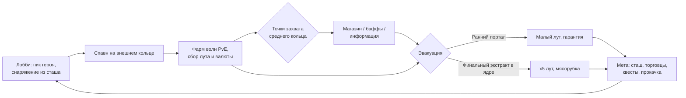

# ADR-001. Концепт игры «Кольцо» (рабочее название)

**Статус:** принят
**Дата:** 2026-07-31
**Жанр:** PvEvP extraction-арена с MOBA-элементами, топ-даун ¾
**Целевой формат:** 3 отряда × 3 игрока на матч. **MVP-формат:** 3 игрока (соло, FFA).

---

## 1. Видение

Сессионный extraction на компактной кольцевой арене. Игрок заходит с героем и снаряжением,
фармит PvE, собирает билд внутри матча, конфликтует за точки захвата и выносит лут через
порталы эвакуации. Смерть = потеря внесённого и нафармленного. Между матчами — таркововская
метапрогрессия: сташ, торговцы, квесты, хайдаут.

Ключевая формула: **петля Tarkov/Arc Raiders + плотность боя Crimsonland + тактика MOBA**.

Референсы: Escape from Tarkov (экономика, ставки), Arc Raiders (PvEvE-давление среды),
Battlerite (боёвка, перспектива), Vampire Survivors (внутриматчевый билд из дропа),
Dark and Darker (extraction без огромной карты).

## 2. Ядро петли

Смерть в матче → потеря внесённого снаряжения (кроме застрахованного) и всего нафармленного.

## 3. Арена

Круглая карта из трёх концентрических зон. Важно: **мобы не заталкивают игроков к центру
физически** — движение внутрь создаётся экономикой времени (см. §3.1).

| Зона | Контент | Риск | Лут |
|---|---|---|---|
| Внешнее кольцо | Спавн-порталы, слабые мобы, ранние эвакуации | Низкий → растёт со временем | Базовый, всегда |
| Среднее кольцо | Элитные мобы, точки захвата | Средний | Хороший |
| Ядро | Босс + свита, финальный экстракт | Максимальный | x5 |

### 3.1. Темп матча: часы тревоги

Три силы, ни одна не толкает в спину — игрок всегда решает сам:

1. **Часы тревоги (push через время).** Уровень тревоги объекта растёт по таймеру матча:
   хозяин осознаёт вторжение. Каждая волна **везде** сильнее предыдущей, но лут и XP
   внешнего кольца остаются базовыми. Внешнее кольцо со временем превращается из
   «безопасно и выгодно» в «опасно и невыгодно»: на 12-й минуте на периферии дерёшься
   с мобами среднего уровня за мусорный дроп. Сложность привязана к часам,
   ценность — к месту (модель Risk of Rain).
2. **Истощение.** Волны в уже зачищенном секторе дают убывающий дроп (лорно: хозяин
   перераспределяет производственные мощности вглубь). Бесконечный фарм у спавна
   перестаёт быть оптимальным математически, а не запрещается правилом.
3. **Притяжение (pull).** Всё желаемое — внутрь: жирный лут и элитки среднего кольца,
   точки захвата, ускоренный заряд ульты у энергоузла, Директор и створ. Центр платит
   за присутствие, а не наказывает за отсутствие.

**Ритм волн — циклы, не поток:** анонс хозяина («фабрикация партии начата») → волна →
окно тишины 60–90 сек. Окна — легальное время на лут, раскидку поинтов (§7), канал захвата
точки, дорогу до раннего портала. Ранний выход — решение «ухожу в окно между волнами»;
замешкался — эвакуируешься под волной, что честно и напряжённо.

Правила зон:

- Спавн-порталы разнесены по краю, минимальная дистанция между отрядами при спавне.
- Ранние порталы эвакуации открываются волнами по таймеру (например, на 5-й и 10-й минуте,
  окно 60 сек). Выход — гарантированный, но лут ограничен тем, что успел собрать.
- Босс активируется в ядре на последних минутах матча (объявляется всем). Финальный
  экстракт открывается **смертью босса** с задержкой ~90 сек: убийцы получают лут и окно
  на дележ/предательство до открытия створа. Не убили босса до конца таймера — финального
  выхода нет, остаются только уже закрытые ранние порталы (то есть никто не вышел с топ-лутом).
- Стены и препятствия блокируют снаряды **и видимость** (fog of war считается сервером).

## 4. Формат матча

- Длительность: 15–20 минут жёсткого таймера. Не эвакуировался — погиб (сжатие зоны не нужно,
  давление создают волны и таймер).
- MVP: 3 игрока соло, FFA. Целевой формат: 3 отряда × 3 (полные пачки, friendly fire off).
- Убийство игрока → выпадает часть его сумки (нафармленное в матче) + внесённое снаряжение
  по правилам страховки.

### 4.1. Социальная динамика (принцип Arc Raiders)

Игроки на карте — не команды по умолчанию. Конфликт, временный альянс против босса,
сговор двое-против-одного и предательство при дележе — **всё легально**. Игра это
не поощряет и не запрещает: никаких механик репутации предателя, штрафов за огонь по
недавнему союзнику, формальных «пактов». Дипломатия — целиком эмерджентная.

Что игра для этого даёт (и только это):

- **Босс, сбалансированный на 2–3 игроков.** Соло-убийство возможно, но требует топ-снаряжения
  и мастерства — экономическое давление к временным альянсам.
- **Проксимити-войс (обязателен в MVP):** открытый голосовой эфир ближнего радиуса
  с позиционным звуком и затуханием. Слышат все в радиусе — и союзники, и жертвы:
  подслушать чужой сговор — легитимная разведка. Мёртвые не говорят (целостность информации).
- **Короткие фразы (обязательны в MVP):** радиальное меню готовых реплик, транслируются
  голосом в том же прокси-радиусе + дублируются пингом. Минимальный набор: «Не стреляю»,
  «Мир?», «Босс — вместе?», «Делим и расходимся», «Уходи», «Помоги», «Сзади!», «Спасибо».
  Это язык переговоров для тех, кто без микрофона — без него безмикрофонный игрок
  выпадает из социальной петли.
- Пинги по миру (метки лута/опасности/направления).
- **Лут босса разделён физически:** несколько контейнеров, раскиданных по арене ядра,
  плюс **один** уникальный предмет (главная ценность). Контейнеры можно молча разобрать
  по одному на брата; уникальный предмет — точка неизбежного решения: делим по-хорошему
  не получится.
- **Окно напряжения:** 90 сек между смертью босса и открытием створа. Достаточно, чтобы
  залутаться и разойтись — или нет.

Правило дизайна: любые будущие механики проверяются на вопрос «убивает ли это неопределённость
момента дележа?» Если да — механика отклоняется.

## 5. Герои

На старте 3 героя, глубина важнее количества. Герой задаёт **способности**;
оружие и предметы — из лута и магазина.

| Герой (роль) | Профиль |
|---|---|
| Бруталь / танк | Ближний-средний бой, контроль пространства, инициация |
| Стрелок | Дистанция, снаряды с упреждением, высокий DPS, низкая живучесть |
| Оператор / саппорт | Контроль, разведка, поддержка, слабый прямой урон |

Кит героя: 2 активные способности + дэш (общая механика, у героев — вариации) + ульта.
Все способности — server-authoritative, клиент предсказывает только движение и косметику.

**Ульта заряжается фармом**: убийства мобов и захваты точек, не время. Следствие — два
легитимных темпа: «жадный фарм → приход в ядро с ультами» против «раш центра голыми, но раньше».

## 6. Точки захвата (среднее кольцо)

Захват любой точки **объявляется всем игрокам** с указанием точки — это двигатель конфликта.

| Точка | Награда владельцу | Двигатель конфликта |
|---|---|---|
| Реле | Позиции игроков сектора на миникарте на N сек | Информация — все хотят её отнять |
| Энергоузел | Глобальный бафф + ускорение заряда ульты в радиусе | Усиление видно по игрокам |
| Фабрикатор | Магазин: владелец покупает со скидкой, чужие — по полной | Экономическое преимущество |

Механика захвата: канал на точке (прерывается уроном), state-машина на сервере:
`нейтральна → захватывается(команда, прогресс) → захвачена(команда) → оспаривается`.
MVP включает **только реле** — самая дешёвая реализация, самый сильный эмоциональный эффект
(«нас видят»).

## 7. Билдостроение

Три слоя силы игрока:

1. **До матча:** пик героя + внесённое снаряжение из сташа (оружие, расходники).
2. **В матче:** уровни носителя (§7.1) + дроп с мобов + покупки в фабрикаторе за валюту матча.
3. **Мета:** прокачка героя/хайдаута между матчами (разблокировки, не голые статы).

### 7.1. Внутриматчевые уровни носителя

XP за убийства и захваты → уровень оболочки → **поинт**. Трата поинта — выбор из
**3 предложенных вариантов** (модель VS/Risk of Rain: карточка = модификатор: скорострельность,
доп. снаряд, вампиризм, ёмкость щита, скорость перегруза...). Правила:

- Выбор занимает секунды и делается в окне тишины между волнами (§3.1) — никаких деревьев
  талантов посреди боя; окно выбора не ставит игру на паузу (мультиплеер).
- Нераскиданный поинт копится, но не даёт ничего — стимул решать.
- Уровни сгорают с концом матча полностью: это сила цикла, не меты.
- Пул вариантов зависит от героя (пересекающийся общий пул + фирменные карточки кита).

### Power budget (правило баланса)

Внесённое снаряжение ограничено слот-лимитом (gear score cap). Основную дельту силы в матче
даёт заработанное **внутри** матча. Цель: исключить сценарий «богатый в мете односторонне
убивает бедного» (болезнь Таркова).

## 8. Метапрогрессия

- Персистентный сташ (ограниченный объём, апгрейдится).
- Торговцы: 2–3 NPC с уровнями лояльности, квестами («захвати реле 3 раза», «вынеси предмет X
  из ядра») и ассортиментом.
- Страховка: внесённое снаряжение возвращается с шансом/задержкой, если его не вынес убийца.
- Хайдаут: пассивные бонусы (крафт расходников, скорость страховки). Пост-MVP.
- Вайпы как сезоны. Пост-MVP.

## 9. Перспектива и боёвка

- **Топ-даун ¾ на 3D-рендере** (камера 50–60°). Симуляция плоская (2D-физика в 3D-мире).
- **Все выстрелы — физические снаряды** с временем полёта. Хитсканов нет. Уклонение — скилл,
  упреждение — скилл, и это же радикально упрощает неткод (см. ADR-002 §5).
- Мувмент: моментум (разгон/торможение), дэш с i-frames и кулдауном, отдача смещает прицел.
- Line of sight: стены блокируют снаряды и видимость; fog of war — серверный.

## 10. Визуальный стиль

Мрачный неон: тёмная среда + эмиссивные снаряды/способности. Ближе к Darktide, чем к
мультяшности. Ассеты — лоуполи-паки (Synty/Kenney), картинку тащат свет и VFX.

Game-feel-чеклист на каждое попадание (обязателен, не опционален): hitstop 30–50 мс,
вспышка шейдера цели, микротряска камеры, партикль, звук с рандомизацией питча.
Трейсеры, гильзы, декали и трупы не исчезают до конца матча.

## 11. Что осознанно НЕ делаем

- Открытый мир, большие карты, выживание (голод/жажда/крафт баз).
- Хитскан-оружие.
- Больше 3 героев до подтверждения петли.
- Клиентские решения по урону/луту/захватам — никогда.
- F2P-монетизация на этапе прототипа — не думаем вообще.

## 12. Реиграбельность

Источники, по убыванию мощности:

1. **Люди.** Каждый матч другой, потому что другие — живые игроки с непредсказуемой
   дипломатией (§4.1). Дележ у трупа Директора — генератор историй; истории — главная
   валюта реиграбельности extraction-жанра.
2. **Экономика меты.** Цикл «заработал → вложил → рискнул → потерял → отстроился»
   (Мул как пол падения) + квесты фракций как цель каждого захода.
3. **Билд-пространство.** Герой × аугменты носителя × внутриматчевые поинты (§7.1) × RNG
   дропа и карточек.
4. **Перестройка объекта.** Хозяин пересобирает «Венец-9» между циклами — буквально:
   при фиксированной кольцевой геометрии от seed варьируются расположение точек и порталов,
   модульные стены секторов, состав волн, плюс 1–2 **директивы цикла** — модификаторы матча
   (см. ADR-003).

Честная оценка: одна арена и три героя — мало контента, MVP держится на пунктах 1–2.
Критерий §13 проверяет именно это: тащат ли ставки и люди без контента. Тащат — контент
доливается спокойно; нет — объём контента не спасёт, и узнать это надо на грейбоксе.

## 13. Критерий успеха концепта

Плейтест MVP с живыми игроками: момент «слышу, что реле захватили — значит нас видят»
вызывает реакцию, игроки просят вторую катку. Если нет — итерируем петлю, не наращиваем контент.

## 14. Amendments

Поправки владельца к принятому концепту. Исходный текст выше не редактируется;
при конфликте действует amendment.

- **A1 (2026-08-03).** Боёвка-глубина (эпик `app-n6g`, спека
  `docs/superpowers/specs/2026-08-03-combat-depth-spec.md`) — уточняет §9:
  топ-даун ¾ и плоская 2D-симуляция движения **сохраняются** (полный TPP-пивот
  рассмотрен brainstorm'ом 2026-08-03 и отклонён), но боёвка углубляется:
  (а) прицел — двухрежимный, снаряды — прямые 3D-отрезки: **по ПКМ** —
  прицельный режим (полупрозрачный луч с точкой; снаряд летит точно в
  указанную точку, хоть в пол; цена — кап скорости движения и замедленный
  слайд, прокачка снимает), **от бедра** — горизонтально на высоте оружия
  с разбросом, растущим от спрея и движения (бег ×1.5, слайд ×2, прокачка
  снижает), ретикл — круг на полу; у мобов и носителя — хитзоны
  голова/тело/ноги с множителями урона (симметрия под PvP Этапа 4);
  (б) мувмент — общий ресурс «стамина» на дэш и слайд: слайд (низкий профиль
  против снарядов, уязвим в ближнем бою, стрельба разрешена) доступен с разгона
  или после дэша; дэш в окне связки после слайда — со скидкой **и без ожидания
  остатка кулдауна** (уточняет «дэш с кулдауном» §9: кулдаун остаётся уздой
  одиночных дэшей, связка легально его обходит — иначе она математически
  невозможна); дэш от стен рикошетит зеркально (базовая механика);
  (в) смерть моба разносит модель по зоне попадания и вектору пули
  (клиентская косметика).
  Перки мобильности/зон — материал карточек §7.1 (система — Этап 3+).
- **A2 (2026-08-17, Этап 2).** Уточняет §3 для Этапа 2: арена — **круг радиусом
  65 м** с кругами-препятствиями **и стенами**, образующими коридоры и укрытия;
  кольцевая застройка трёх зон со створом и порталами — Этап 3. Стены — не
  косметика: они задают линии обзора серверного фильтра видимости, а тот —
  вместе с `SightRadius` 45 м — сегодня определяет и то, кого слышно: голос
  привязан к присутствию собеседника в снапшоте, поэтому за стеной наступает
  тишина, а за пределами 45 м её даёт уже дистанция, без всякой стены
  (см. ADR-002 A12, `app-bnl`, `app-ne3`).
- **A3 (2026-08-17, Этап 2).** Уточняет §10: FIFO-лимиты персистентных следов
  (гильзы, трассеры, декали, трупы, пятна дэша) подняты под **троих игроков** и
  `MaxMobs 96` — «не исчезают до конца матча» остаётся правилом, но с потолком,
  посчитанным на троих, а не на одного.
- **A4 (2026-08-24, Этап 3).** Уточняет §3: **ранние порталы открыты с начала
  захода** в обоих кольцах и закрываются активацией Директора; активацию
  запускает **вход сборщика в ядро**, а не таймер (решение Р299). Взамен
  формулировки «открываются волнами по таймеру, окно 60 сек». Следствие
  называется явно: ритм «эвакуация в окно между волнами» §3.1 этим **отменяется**
  — выход перестал быть привязан к паузе, он теперь привязан к решению зайти
  вглубь.
- **A5 (2026-08-24, Этап 3).** Уточняет §4 на срок до появления страховки (Э5):
  труп сборщика лутается **полностью**, а не «часть сумки + внесённое по
  правилам страховки». Страховка вводится вместе с метой Этапа 5, и до тех пор
  делить нечего.
- **A6 (2026-08-24, Этап 3, задача `app-ggvz`).** Уточняет §3.1 «Ритм волн»:
  волны идут **не одним циклом на арену, а независимым циклом на каждое
  кольцо**. Окно тишины не выдаётся по расписанию — оно **зарабатывается
  зачисткой кольца** и длится 20/30/30 секунд (внешнее/среднее/ядро) вместо
  «60–90 сек». Формулировка «каждая волна **везде** сильнее предыдущей»
  сохраняется буквально и исполняется **единым шагом сложности от часов
  захода** (решение Р315), а не счётчиком волн каждого кольца: счётчик означал
  бы, что хорошо играющий встречает волны СЛАБЕЕ пассивного — прямо против
  «сложность привязана к часам, ценность — к месту».
- **A7 (2026-08-24, Этап 3, решения Р340/Р346).** Уточняет §3.1 — **честная
  граница канона, и она намеренна**. Рост волны конечен: размер упирается в
  потолок одной волны на 2.4-й минуте, доля элиты периферии — на 12.0-й, ровно
  на канонной двенадцатой минуте. После этого волна постоянна, и давление
  создаёт **накопленное население против потолка кольца**, то есть цена отказа
  чистить.
  ⚠ **Это рычаг, а не признаваемый дефект** (решение владельца Р346): внешнему
  кольцу ПОЛОЖЕНО становиться скучным — так работает «Притяжение (pull)» того же
  §3.1. Периферия исчерпывается, центр платит за присутствие, и сборщика
  выталкивает внутрь не запретом, а арифметикой. Растущий потолок волны и
  растущий потолок кольца рассмотрены и отклонены: до появления эпика «Рост
  носителя» текущие волны и так не проходятся без прокачки.
- **A8 (2026-08-24, Этап 3, решение Р347).** Дополняет §3.1: состав волны обязан
  нести **оба вида давления — ближний и дальний бой — до конца захода**. Доля
  стрелков растёт весь заход, но не вытесняет бегущих в упор: вся механика
  уклонения (дэш, слайд, силовой кокон A1) построена вокруг ближнего боя, и
  заход, в котором ближний бой выключается на пятой минуте, две трети времени
  не пользуется собственной боёвкой.
- **A9 (2026-08-24, Этап 3, задача `app-d2ki`).** Дополняет §3.1: **элита
  среднего кольца привязана к своему кольцу** и не преследует сборщиков во
  внешнее. Внешнее кольцо — зона входа, и его кривая сложности ломается, если
  туда приходит элита соседнего кольца. Привязка действует во всех фазах захода
  (не только в фарме): вопрос, на который она отвечает, — «насколько труден
  вход», а он не зависит от того, проснулся ли Директор.
- **A10 (2026-09-03, эпик `app-88jb`, лор владельца Р370).** Дополняет §7 и §7.1
  диегетикой, которой у слоёв силы не было. Сборщик приходит на объект **пустым
  по расходникам**: тело печатается на самом заводе, на взломанном принтере, а
  оператор ведёт его с корабля по **тонкому каналу** — и именно узость канала, а
  не условность, есть причина фиксированного набора параметров тела,
  ограниченного рюкзака и того, что поднятое утилизируется на месте. Отсюда
  устройство прокачки **внутри** захода (§7.1, слой 2): оружие носится **в двух
  слотах**, матрицы орудий снимаются **с трупов**, а **боезапас и обвесы
  печатаются портативным принтером по ходу забега**. ⚠ **Само оружие
  перепечатать нельзя** — чертежа у сборщика нет; чужое подобрать можно.
  Модули способностей переданы с корабля **при сборке тела**, и мета (§8)
  торгует **числом слотов и выбором модуля на сборке**, а не самими
  способностями: граница «кит принадлежит слепку, числа и утилиты — телу»
  (ADR-003 §7.1/§7.3) сохраняется буквально. Силовой кокон носителя (ADR-003 A1)
  **перезаряжается в бою, но В ЗАХОДЕ не усиливается** — внутри цикла растут
  слоты, а не он; межзаходную прокачку кокона (A1) это не отменяет.
- **A11 (2026-09-03, эпик `app-88jb`, решения Н13/Н14/Н16/Н19, Р362–Р365, Р396).**
  Уточняет §9 и пункт (а) амендмента A1 — **у выстрела появляется физика удара,
  а у полёта — излом**.
  **(а) Масса и импульс.** У снаряда есть масса (`ProjectileMass`), и попадание
  сообщает телу приращение скорости
  `Δv = min(ProjectileMass × |Vel| / TargetMass, ImpactSpeedCap) / damping`,
  где `|Vel|` — **полная, трёхмерная** скорость снаряда.
  ⚠ **Масса снаряда — величина игровая, а не килограммы** (Р371): честные 50 г
  при 52.5 м/с двигают 90-килограммовую машину на 0.029 м/с, то есть на толчок,
  которого не видно. Стартовые 2.6 (оружие сборщика) и 3.0 (оружие мобов)
  посчитаны обратным счётом от желаемого Δv; массы **тел** остаются
  килограммами и работают отношением друг к другу. Потолок одного толчка —
  свойство того, кого толкают (`ImpactSpeedCap` 6 м/с у каждого тела), и для
  сборщика он делится на силовой кокон (`CocoonDamping` 3.0), то есть
  эффективно 2 м/с.
  **(б) Рикошет — часть базовой механики**, а не фича оружия, и считается **по
  прецеденту дэша об стену** (дословная формулировка владельца Н19): угол по
  модулю, скорость гасится `RicochetRetention` 0.8. **Порога угла нет вовсе** —
  стрельба из-за угла по определению даёт скользящий удар, и порог отсекал бы
  ровно те отскоки, ради которых заводился. Против бесконечных слабых отскоков
  работают счётчик `MaxRicochets` 2 и порог `RicochetMinSpeed` 6 м/с: ниже него
  снаряд гаснет, а не отражается. ⚠ **Следствие для §3 и §9:** «стены и
  препятствия блокируют снаряды» читается теперь как «останавливают **или
  отражают**». **Пол не рикошетит** (у него нет модельной нормали) и **тела не
  рикошетят** — отражение от движущегося тела клиент повторить не может, и
  трассер разошёлся бы с сервером.
  **(в) Полёт перестал быть прямой.** Формулировка A1 «снаряды — прямые
  3D-отрезки» уточняется: траектория — **ломаная**, прямая между отскоками.
  Гравитации, параболы и сопротивления по-прежнему нет (Н13) — вертикальная
  скорость постоянна между столкновениями.
  **(г) Пробитие мелких целей** вводится вместе со своей ручкой: цель
  пробивается, если `ProjectileMass / TargetMass > PierceMassRatio` и урон
  превышает её остаток здоровья; снаряд летит дальше, потеряв половину урона.
  ⚠ **При стартовом 0.06 не пробивается никто, включая ганнера, и это
  намеренно** — механика включается прокачкой эпика «Рост носителя» (ADR-002
  A19) через рост массы снаряда: чейзер начнёт пробиваться примерно с 5.4.
  **(д) Потолок скорости снаряда поднят 100 → 300 м/с** (Н16). ⚠ **И здесь
  нужна оговорка, потому что прокачка это число двигает:** при 300 м/с снаряд
  проходит **10 м за тик**, весь бой на двадцати метрах укладывается в **два
  тика**, упреждение (0.33 м) становится меньше радиуса тела сборщика (0.45 м),
  и система делается функционально **неотличимой** от лаг-компенсированного
  хитскана; заодно фактически отключается правило «не более одного пробития за
  тик». **§11 («что осознанно НЕ делаем: хитскан-оружие») этим не нарушается** —
  снаряд остаётся физическим телом с временем полёта при любой скорости, — но
  граница названа честно, и она проектная: 143 м/с (`20 м / 0.140 с`) в код не
  попадает, а потолок 300 живёт редакторским диапазоном поля, а не константой
  протокола. Переключателя режимов неткода по скорости не будет вовсе
  (Н7/Р359, Р372): поправка на сеть убывает **сама** по мере роста скорости,
  и прокачка двигает одно число.
- **A12 (2026-09-03, эпик `app-88jb`, решение Н8/Р360).** Уточняет пункт (а)
  амендмента A1: «хитзоны голова/тело/ноги» перестают быть тремя полосами по
  высоте на одном круге и становятся **набором частей тела**, у каждой из
  которых **свой радиус в плане** и **свой высотный пояс**. Причина —
  измеренная, а не эстетическая: голова имела полуширину **плеч** (0.5 м, ровно
  как корпус), поэтому попадание в плечо на высоте головы засчитывалось
  хедшотом с множителем 1.7, а верхушка модели не простреливалась вовсе —
  модель выше своей расчётной колонки в 1.46 (чейзер), 1.20 (ганнер) и 1.37
  (Директор) раза. Теперь голова у чейзера и ганнера — **0.17 м** полуширины и
  примерно **пятая часть колонки** (21–23 % у всех пяти тел), а колонка каждого
  из четырёх мобьих архетипов масштабирована на измеренный коэффициент своей
  модели (ASSETS-001).
  ⚠ **Сборщик — намеренное исключение, и его надо знать.** Он не из того пака,
  откуда четыре архетипа, поэтому спека даёт ему `k = 1` и высоты **не двигает**:
  они те же 0.55 / 1.35 / 1.75, что и с первого таска, новы только радиусы
  частей. Т12 его всё же померил, и вышло **1.0481** — нарисованная крона
  1.8342 м против колонки 1.75, то есть **верхние ~8 см его модели остаются вне
  объёма попадания**, ровно тот дефект, который эта фаза закрывает остальным
  четырём. Оставлено по букве спеки и записано, а не округлено; к PvP Этапа 4,
  где по сборщику будут стрелять живые люди, это вопрос владельца. Части
  **соосны** и поз не имеют — это продолжение прежнего решения «фиксированные
  объёмы без поз». Попадание ровно в границу принадлежит **верхней** части.
  ⚠ **Часть не может быть шире тела** — правило валидации, а не соглашение
  данных: тело собирает кандидатов по своему радиусу, и часть шире него не
  попала бы в выборку молча. Потолок прицеливания поднят с 3.8 до **4.9 м**,
  чтобы накрыть самое высокое тело (Директор, 4.79). ⚠ **Хедшот стал заметно
  труднее** — это и есть цель правки, названная владельцу до вехи В2.
- **A13 (2026-09-03, эпик `app-88jb`, решения Н15/Н20/Н21, Р364/Р397/Р398,
  Р441).** Дополняет §9 («Мувмент») тем, о чём ADR не говорил, а код решал молча:
  **тела больше не проходят друг сквозь друга**. Разводятся жёстко **все три
  пары** — сборщик↔моб, моб↔моб и сборщик↔сборщик; прежнее мягкое
  расталкивание силой в скорость оставляло мобов наслаиваться, а сборщика
  пропускало сквозь толпу насквозь.
  ⚠ **Клиент предсказывает разведение только от ВИДИМЫХ ему тел** (Н20:
  «кажется, будет интереснее, особенно проходить сквозь толпу мобов на дэше») —
  иначе предсказание стало бы функцией тел, которых клиент по критическому
  правилу 4 не получает вовсе, и в толпе стороны расходились бы каждый тик.
  ⚠ **Внутри самой симуляции фильтра видимости при этом НЕТ**, и это записано
  честно: видимость считает сетевой слой, а симуляция его читать не может
  (критическое правило 1), поэтому сервер разводит от всех тел. Сегодня разницы
  не возникает, и это арифметика, а не надежда: перекрытие требует меньше 0.95 м,
  а два тела по разные стороны любого блокера стоят не ближе **2.15 м** — тело в
  контакте видимо всегда. ⚠ Случай «тело выпало из набора клиента по бюджету
  кадра, а не по линии взгляда» этим не покрыт и остаётся решением владельца.
  ⛔ **И сверх того — сегодня боевой клиент не разводится ВООБЩЕ.** Единственный
  боевой вызов предсказания передаёт **пустой** набор тел: в сетевой игре сервер
  разводит, клиент нет, и каждый контакт с мобом даёт рывок поправки. Оффлайн и
  внутриигровой сервер работают полностью. Это открытая задача **`app-njmi`**
  (P1). ⇒ Правило выше — то, **как оно устроено**, а арифметика 0.95 против
  2.15 м — про это правило, а не про сегодняшний билд.
  ⚠ **Дэш расталкивает тела, но платит за это собственной скоростью** — не
  «проскакивает бесплатно»: принятый толчок вычитается из текущей скорости рывка
  проекцией на его направление, а у слайда на ту же величину растёт штраф
  скорости.
  ⚠ **Следствие, которое надо знать заранее** (Р441): **слайд не проходит под
  телами** — в слайде тела для сборщика такие же препятствия, как стоя. Правило
  «проходит под телом, у которого на высоте профиля нет частей» не пишется
  вовсе: у чейзера и Директора ноги начинаются от земли, а «проходит под
  ногами» физически означает «проходит сквозь ноги». Низкий профиль слайда
  против **снарядов** (A1, пункт б) при этом сохраняется буквально.
- **A14 (2026-09-03, эпик `app-88jb`, решение Н10/Р361/Р366).** Уточняет §10:
  из обязательного game-feel-чеклиста **удаляется hitstop**. Сам чеклист
  остаётся обязательным, и остальные его пункты — вспышка шейдера цели,
  микротряска камеры, партикль, звук с рандомизацией питча — сохраняются
  буквально. Уходит только замирание кадра: оно **подменяло** удар, а не
  изображало его. Взамен попадание показывают **толчок тела, крен от точки
  приложения силы и опрокидывание** (A11): моб физично заваливается туда, куда
  пришёлся выстрел. ⚠ **Голову при этом не дёргает** — поправка владельца
  дословно: «у половины мобов и головы как таковой нет»; заваливается тело
  целиком. ⚠ **Читаемость попадания от удаления не падает** — проверено по
  коду, а не обещано: остаются вспышка, тряска (`TraumaHit` 0.2,
  `TraumaPlayerHit` 0.45), искры, звук и подсветка прицела красным на голове со
  звуковым тиком на переходе; плюс появляется главный сигнал — сам толчок.
  ⚠ **Та же формулировка живёт в ADR-002 §8 «Этап 1»** и снимается там же
  (ADR-002 A27) — иначе два ADR говорили бы разное; прецедент — ADR-002 A18.
