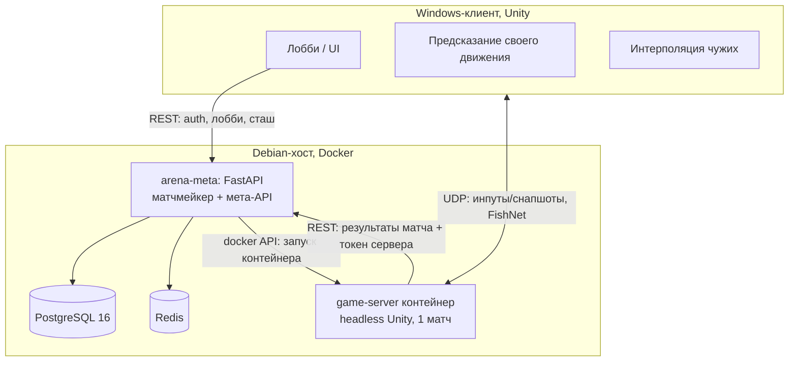

# ADR-002. Техническая архитектура и план разработки (для Claude-агентов)

**Статус:** принят
**Дата:** 2026-07-31
**Связан с:** ADR-001 (концепт)
**Граница MVP:** играбельный прототип с демонстрацией логики и механик. Лобби — минимум,
подбор — минимум (вход по коду комнаты). Сервер — Debian + Docker + PostgreSQL.
Клиент — Windows-билд; Linux-клиент желателен, но в MVP не обязателен.

---

## 1. Технологические решения (мини-ADR)

| # | Решение | Обоснование | Отвергнутые альтернативы |
|---|---|---|---|
| T1 | Unity 6 LTS + URP | Один код симуляции клиент/сервер, headless Linux-билд, зрелая экосистема | Godot (слабее неткод-экосистема), свой сервер на .NET (терям физику/navmesh, симуляция дважды) |
| T2 | FishNet (сетевой стек) | CSP + reconciliation из коробки, tick-based, interest management, бесплатен, без vendor lock | Photon Fusion/Quantum (SaaS, CCU-прайсинг, санкционные риски), Mirror (нет предсказания из коробки), NGO (сырой) |
| T3 | Сервер: headless Unity в Docker, 1 контейнер = 1 матч | Изоляция, простой lifecycle, ложится на существующую инфраструктуру | Многоматчевый процесс (сложнее, не нужно на этом масштабе) |
| T4 | Мета: FastAPI + PostgreSQL 16 + Redis | Родной стек владельца проекта; матчмейкер, сташ, торговцы — обычный backend | Встраивать мету в Unity-сервер (смешение ответственностей) |
| T5 | Тикрейт 30 Гц симуляция / 30 Гц снапшоты; мобы 10–15 Гц | Достаточно для топ-дауна со снарядами, CPU-бюджет 1 vCPU на матч | 64 Гц (не нужен без хитскана) |
| T6 | Все выстрелы — снаряды; lag compensation минимальна, кап отмотки 200 мс | Снаряды живут в серверном настоящем — проблема «за углом» почти исчезает | Хитскан + полный rewind (источник жалоб «убил за стеной») |
| T7 | Interp-буфер фиксированный ~100 мс (2 снапшота) | Стабильность важнее адаптивной красоты | Адаптивный буфер |
| T8 | Симуляция — чистый C#-assembly (asmdef) без UnityEngine-зависимостей в логике | Детерминизм, юнит-тесты в EditMode/NUnit без запуска сцены, одинаковое исполнение клиент/сервер | Логика в MonoBehaviour (нетестируемо, недетерминированно) |
| T9 | Fog of war и видимость — на сервере (interest management) | Wallhack невозможен по построению | Клиентский фог (читы за вечер) |
| T10 | Два репозитория: `arena-game` (Unity клиент+сервер), `arena-meta` (FastAPI) | Разные toolchain, CI, ритмы релизов; infra-репо пока не нужен (docker-compose живёт в arena-meta) | Монорепо (LFS-гигабайты мешают backend-агентам) |
| T11 | Голос: **Dissonance Voice Chat** (Asset Store) поверх FishNet, релей через игровой сервер | Self-hosted (никакого стороннего SaaS/CCU-прайсинга/гео-рисков), позиционный звук и затухание из коробки, Opus ~24 кбит/с на говорящего — трафик пренебрежим при 3–9 игроках | Unity Vivox (SaaS UGS — vendor lock + гео-риск), ODIN (SaaS), свой Opus-релей (месяц работы ради велосипеда; запасной вариант, если интеграция Dissonance↔FishNet окажется битой — проверить спайком на Этапе 2) |

## 2. Архитектура системы



Жизненный цикл матча:

1. Клиент логинится в мету, создаёт/входит в комнату по коду.
2. Когда комната готова, матчмейкер поднимает контейнер game-server (docker API),
   передаёт ему match-config (JSON: список игроков, seed, серверный токен) через env/volume.
3. Матчмейкер отдаёт клиентам `ip:port + join-token`.
4. Клиенты подключаются напрямую (UDP). Сервер валидирует join-token.
5. По окончании сервер POST-ит результаты (`/internal/match-result`, авторизация серверным
   токеном) и завершается; контейнер удаляется.

## 3. Репозиторий arena-game: структура

```
arena-game/
├── Assets/
│   ├── Scripts/
│   │   ├── Simulation/          # asmdef: чистый C#, БЕЗ UnityEngine (см. §4)
│   │   │   ├── Core/            # тики, состояние мира, RNG от seed
│   │   │   ├── Movement/        # моментум, дэш, коллизии (2D-физика)
│   │   │   ├── Combat/          # снаряды, урон, хитбоксы
│   │   │   ├── Abilities/       # исполнение способностей, ульта
│   │   │   ├── AI/              # стейт-машины мобов, волны от seed
│   │   │   └── Objectives/      # точки захвата, эвакуации, таймер матча
│   │   ├── Networking/          # FishNet: prediction-обвязка, снапшоты, IM
│   │   ├── Presentation/        # рендер, VFX, звук, game feel, камера
│   │   ├── Meta/                # REST-клиент меты, лобби UI
│   │   └── Server/              # bootstrap headless, match-config, репорт результатов
│   ├── Data/                    # ScriptableObjects: герои, способности, мобы, лут-таблицы
│   ├── Prefabs/  Scenes/  Art/  Audio/
├── Tests/EditMode/              # NUnit-тесты Simulation
├── server/
│   ├── Dockerfile               # linux headless билд
│   └── entrypoint.sh
├── ProjectSettings/  Packages/
└── CLAUDE.md
```

## 4. Критические правила для агентов (копировать в CLAUDE.md репо verbatim)

```
CRITICAL RULES — arena-game
1. Assets/Scripts/Simulation/** не импортирует UnityEngine (исключение: Unity.Mathematics).
   Никаких Time.deltaTime, Random.value, MonoBehaviour, коллбеков Unity. Только тики,
   фиксированный dt и RNG, сидированный из match-config.
2. Вся симуляция — детерминированные функции (state, input, tick) -> state.
   Новая механика = сначала NUnit-тест в Tests/EditMode, потом реализация (TDD).
3. Сервер авторитетен по: урон, хиты, смерть, лут, захваты, ульты, эвакуации, таймер.
   Клиент предсказывает ТОЛЬКО собственное движение/дэш; всё остальное — интерполяция
   и косметика. Любой PR, где клиент решает игровой исход, отклоняется.
4. Fog of war / видимость — только сервер (interest management). Клиент не получает
   позиции невидимых ему сущностей.
5. Снаряды симулируются сервером в серверном настоящем. Lag compensation — только там,
   где явно решено, кап отмотки 200 мс.
6. Все игровые параметры (урон, кулдауны, скорости, волны, лут) — в ScriptableObjects
   (Assets/Data), не в коде. Баланс правится без перекомпиляции логики.
7. Каждый плейтест-билд гоняется с latency simulator: 80 мс RTT + 5% loss. Фича,
   не проверенная под лагом, не считается готовой.
8. Бинарные ассеты — через Git LFS. Meta-файлы Unity коммитятся всегда
   (.gitignore из шаблона Unity, Visible Meta Files, Force Text serialization).
9. Не добавлять сторонние ассеты/пакеты без записи в ADR-002 §1.
```

## 5. Неткод: параметры и реализация

- FishNet PredictionV2: клиент шлёт инпуты (не позиции), предсказывает своего персонажа,
  reconciliation по серверному стейту с номером тика.
- Чужие сущности: интерполяция между снапшотами, буфер фиксированный ~100 мс.
- Снаряды: спавн подтверждает сервер; клиент стрелка рисует снаряд немедленно (косметика),
  авторитетная траектория — серверная. Расхождение маскируется VFX.
- Способности: клиент мгновенно проигрывает анимацию/движение (дэш — часть prediction),
  эффекты (урон, стан) применяет только сервер.
- Interest management: grid или distance-based + серверный LoS-фильтр.
- Мобы: обсчёт 10–15 Гц, репликация только видимых; спавн волн — событие с seed,
  клиент разворачивает состав волны локально из детерминированного генератора.

## 6. Схема БД меты (MVP-минимум)

```sql
players(id uuid pk, login text unique, pass_hash text, created_at timestamptz);
stash_items(id uuid pk, player_id fk, item_code text, qty int, meta jsonb);
matches(id uuid pk, room_code text, seed bigint, status text
        /* lobby|running|finished|aborted */, server_addr text,
        created_at, started_at, finished_at);
match_players(match_id fk, player_id fk, hero_code text, join_token text,
              result text /* extracted_early|extracted_core|died|dc */,
              loot jsonb, kills int, pk(match_id, player_id));
```

Redis: комнаты лобби (TTL), join-токены, серверные heartbeat-и.

## 7. REST-контракт меты (MVP-минимум)

```
POST /auth/register            {login, password} -> {token}
POST /auth/login               {login, password} -> {token}
GET  /stash                    -> [{item_code, qty}]
POST /rooms                    -> {room_code}
POST /rooms/{code}/join        {hero_code} -> {status}
GET  /rooms/{code}             -> {players[], status, server?: {addr, join_token}}
POST /rooms/{code}/start       (создатель) -> 202; матчмейкер поднимает контейнер
POST /internal/match-result    (auth: server token) {match_id, players[{result, loot,...}]}
```

Никакого WebSocket в MVP: клиент поллит `GET /rooms/{code}` раз в 2 сек до получения адреса.

## 8. Этапы разработки до MVP

Каждый этап = эпик в Beads. Definition of done обязателен. Порядок жёсткий:
следующий этап не начинается, пока DoD текущего не закрыт плейтестом.

### Этап 0. Скелет (оценка: маленький)
Unity 6 + URP, структура папок §3, asmdef Simulation с первым тестом (пустой мир тикает
детерминированно: одинаковый seed → одинаковый хеш состояния через 1000 тиков),
Git LFS, CLAUDE.md с Critical Rules.
**DoD:** проект собирается в Windows-билд и Linux headless; тест детерминизма зелёный.

### Этап 1. Боёвка соло, без сети (ядро удовольствия)
Движение с моментумом, дэш с i-frames, камера ¾, прицел курсором, одно оружие
(снаряды), 2 типа мобов на стейт-машинах, волны от seed, смерть/HP.
Game-feel-пасс: hitstop, тряска, партикли, звук (см. ADR-001 §10).
**DoD:** 5 минут соло-геймплея «стрелять приятно» на плейтесте. Если не приятно —
итерации здесь, дальше не идём.

### Этап 2. Сеть
FishNet: prediction движения/дэша, серверные снаряды и мобы, interest management + LoS,
headless-сервер в Docker (Dockerfile + entrypoint), подключение 3 клиентов по ip:port.
Latency simulator включён по умолчанию в дев-билдах.
Спайк: Dissonance поверх FishNet через headless-релей в контейнере — работает/не работает
решается здесь, чтобы к Этапу 4 не осталось неизвестных (запасной план — свой Opus-релей, T11).
**DoD:** 3 клиента (2 Windows + 1 в editor) играют матч против волн через контейнер
на Debian-хосте при 80 мс/5% loss без видимых рывков; урон и смерть — только серверные.

### Этап 3. Extraction-петля
Кольцевая арена (грейбокс), градиент сложности волн от края к центру, лут с мобов,
инвентарь матча, ранние порталы по таймеру, финальный экстракт в ядре, таймер матча,
экран результатов.
**DoD:** полный матч 15 минут: зашёл → нафармил → эвакуировался/погиб, результат
корректно посчитан сервером.

### Этап 4. PvP + реле + голос
Урон по игрокам, дроп сумки с убитого, точка захвата «реле» (канал, state-машина,
глобальный анонс, показ позиций сектора владельцу), FFA-скоринг.
**Проксимити-войс:** Dissonance, позиционный звук, затухание по радиусу, мут мёртвых.
**Короткие фразы:** радиальное меню, набор из ADR-001 §4.1, трансляция в прокси-радиусе
+ пинг-дубль; на MVP фразы — TTS-заглушки (генерация — твой конвейер), озвучка позже.
**DoD:** плейтест 3 игроков FFA: конфликт за реле возникает без уговоров; двое договариваются
голосом при живом третьем в радиусе слышимости; игрок без микрофона ведёт переговоры фразами.

### Этап 5. Герой №1 + мета-минимум
Полный кит первого героя (2 способности + дэш-вариация + ульта от фарма),
ScriptableObject-пайплайн способностей. arena-meta: auth, сташ, комнаты по коду,
запуск контейнера через docker API, приём результатов, перенос лута в сташ,
докер-компоуз (meta + PG + Redis) на Debian-хосте. Лобби-UI в клиенте.
**DoD = граница MVP:** два человека с разных Windows-машин регистрируются, создают
комнату по коду, играют полный матч на удалённом Debian-сервере, вынесенный лут
появляется в сташе и доступен в следующем матче.

### Пост-MVP (не начинать до плейтестов MVP)
Герои №2–3, фабрикатор и энергоузел, магазин, торговцы и квесты, страховка, отряды 3×3,
Steam-интеграция, Linux-клиент, хайдаут, арт-пасс вместо грейбокса.

## 9. Процесс работы агентов

- Пайплайн `brainstorm → spec → plan → impl`; ADR-001/002 — вход для spec-фазы каждого этапа.
- Трекер — Beads (`bd`): эпик на этап, issues на фичи. Session handoff по принятому шаблону,
  Critical Rules (§4) копируются verbatim.
- TDD для Simulation обязателен; Presentation/Networking — тесты по возможности,
  плейтест как основной критерий.
- Ветки: worktree на issue, PR в main, CI: (a) NUnit EditMode, (b) сборка Linux headless,
  (c) сборка Windows-клиента. CI на GitLab CE (git.itscrm.ru), Unity-билды через
  游戏CI/unity-builder-образы или лицензированный build-агент — решить на Этапе 0.
- Человек в цикле: game-feel (Этап 1) и плейтесты — единственные фазы, где вкус владельца
  важнее автотестов; агенты готовят параметры для быстрой ручной итерации
  (все числа в ScriptableObjects, hot-tweак в PlayMode).

## 10. Amendments

Поправки владельца к принятым решениям. Исходный текст выше не редактируется;
при конфликте действует amendment.

- **A1 (2026-07-31).** Один репозиторий `ring_app` на GitHub — замещает T10
  (два репо) и §9 (GitLab CE/git.itscrm.ru): `client/` Unity + `server/` FastAPI-мета.
- **A2 (2026-07-31).** CI до MVP отсутствует — замещает CI-строки §9; сборки и деплой
  вручную; registry (⭐ ghcr.io) — решить к Этапу 2.
- **A3 (2026-07-31).** Рабочая станция — Linux; Windows-клиент кросс-сборкой (Mono).
- **A4 (2026-07-31).** Docker-упаковка game-сервера — `client/docker/` (вместо
  `server/` из §3 — конфликт имён с FastAPI-метой).
- **A5 (2026-08-02).** Версия движка: Unity 6.3 LTS **6000.3.21f1** (уточняет T1;
  ветка 6000.0 теряет поддержку в октябре 2026).
- **A6 (2026-08-02).** Unity MCP: **CoplayDev/unity-mcp** (dev-time пакет; запись
  по критическому правилу 9 §4).
- **A7 (2026-08-02).** Слой `client/Assets/Scripts/Data/` (asmdef `Ring.Data`:
  SO-классы баланса + конвертация в plain SimConfig) — дополняет структуру §3;
  server-ownership.
- **A8 (2026-08-03).** Сторонние ассеты (запись по критическому правилу 9 §4):
  четыре CC0-пака Quaternius — Universal Animation Library (+UAL2), Animated
  Mech Pack, Sci-Fi Essentials Kit Standard — в `client/Assets/ThirdParty/`
  (Git LFS); отбор, лицензии и правила импорта —
  `docs/adr/ASSETS-001-Модели-и-анимации.md` + `CREDITS.md`. Наши производные
  (Animator-контроллеры, маски, материалы превью) — `client/Assets/ThirdParty/_Ring/`.
- **A9 (2026-08-03).** Этапность (дополняет §8): между Э1 и Э2 решением
  владельца вставляется эпик `app-n6g` «Боёвка-глубина» (3D-прицел по лучу,
  хитзоны, стамина-мувмент слайд/дэш/рикошет, обломки; спека
  `docs/superpowers/specs/2026-08-03-combat-depth-spec.md`). DoD: вехи В1–В3
  приняты владельцем плейтестом; `app-5nu` (Э2) разблокируется только после
  этого. CR 7 (latency) к пакету неприменим — сети нет; повторный гейт
  механик пакета под лагом — обязательная часть DoD Э2.
- **A10 (2026-08-03).** Сторонний ассет (по критическому правилу 9 §4):
  анимация Mixamo `Running Slide` (источник закреплён ASSETS-001 §1.4) —
  импорт в `client/Assets/ThirdParty/_Ring/` по правилам ASSETS-001 §4.2,
  строка в `CREDITS.md` с пометкой «no redistribution» (лицензия Mixamo:
  распространение только в составе проекта). Фолбэк при кривом ретаргете —
  процедурный присед (решение владельца на вехе В3).
  - **Изменение (2026-08-04, решение владельца на вехах В1/В2, формат 1a).**
    Mixamo-импорт отменён: слайд-анимация берётся из уже лицензированного
    пака UAL2 — клипы `Slide_Start` / `Slide_Loop` / `Slide_Exit` из
    `UAL2_Standard.fbx` (тот же скелет, что у куклы; loop покрывает
    переменную длительность слайда). Новых сторонних ассетов не добавляется;
    CREDITS.md не меняется (UAL2 уже учтён). Фолбэк-оговорка (процедурный
    присед) сохраняется.
- **A11 (2026-08-17, Этап 2).** Уточняет T5: мир тикает **30 Гц целиком** —
  отдельного «медленного» контура нет. Бюджет CPU определяется замером под
  `--cpus=1` с капом кадров; при нехватке растёт контейнер, а не падает частота
  тика. Замер Этапа 2 на внешнем хосте: CPU 2.9–4.2 % на троих,
  `tickAvgMs` 0.115–0.288 из 33.3 при пике 20.3.
- **A12 (2026-08-17, Этап 2).** Замещает T11 в части продукта. ⚠ Гейт Ф10
  (коммит `aac4d34`) правил строку T11 и два места §8 **по месту**, вопреки
  правилу этого раздела; решением владельца 2026-08-17 исходный текст §1 и §8
  восстановлен, и продуктовое решение живёт только здесь. Итак: голос —
  **MetaVoiceChat (MIT)**, вендоринг в `client/Assets/Plugins/MetaVoiceChat/`;
  Dissonance — план Б, свой релей — план В. **Спайк Этапа 2 исполнен и принят
  (вердикт GO, 2026-08-17):** релей — наш игровой сервер (FishNet
  `ServerRpc` → `ObserversRpc`, unreliable), кодек Opus работает на клиентах,
  разговор по push-to-talk, затухание считается нашим кодом по `HearRadius`.
  Живой прогон двоих через headless-контейнер: матч 250.9 с, `exitCode=0`,
  тик сервера 0.151 мс, входящий трафик клиента 1.6 КБ/с медиана при максимуме
  5.7 против бюджета 40. Планы Б и В не понадобились; покупать ничего не нужно.
  **Не закрыто спайком:** разборчивость под 80/5 (прогон шёл без латсима) и
  модель окклюзии — голос сейчас слышен, только пока собеседник находится в
  СЕРВЕРНОЙ ВИДИМОСТИ (присутствует в снапшоте: `SightRadius` 45 м и линия
  обзора), а не в пределах `HearRadius`; слышно и за краем экрана, но не за
  стеной (`app-bnl`, решение — Этап 4). ⚠ Само затухание подтверждено слухом
  владельца, но НЕ числом: диагностическая строка показывала ноль там, где речь
  была слышна (`app-ne3`).
- **A13 (2026-08-17, Этап 2).** Уточняет §8: **минимальный PvP-урон переносится
  в Этап 2** — игроки могут убивать друг друга; экономика PvP (дроп сумки,
  скоринг, условие победы) остаётся в Этапе 4.
- **A14 (2026-08-17, Этап 2).** Уточняет A2 и §8: образ game-сервера собирается
  **локально** (`client/docker/build.sh`) и доставляется через **Docker Hub,
  приватный репозиторий**, на хост. Спека §9 говорила «хост локальной сети»;
  фактически Этап 2 развернулся на ВНЕШНЕМ хосте (решение владельца, Ф10).
  CI по-прежнему нет.
  **Фактическая оговорка:** на Этапах Ф10 и Ф11 доставка исполнялась
  `docker save | ssh docker load` — учётные данные приватного реестра
  сознательно не заносились на хост со сторонними службами. Путь через
  `docker login` + `pull` записан в `docs/deploy.md` штатным и живьём не
  прогонялся (открытый вопрос Е-19; называть `save/load` исполненным протоколом
  или прогнать реестр — решение владельца).
- **A15 (2026-08-17, Этап 2).** Дополняет §3 и §1: подпапка
  `Simulation/Visibility/`, сборки `Ring.Networking` и `Ring.Server`, сцена
  `Server.unity`, каталог `Assets/Plugins/`; FishNet ставится UPM git-URL с
  пином на тег (4.7.2). **Отдельной строкой:** interest management из T2
  («из коробки») в этом проекте **не используется**: мобы, снаряды и пропсы
  вообще не являются `NetworkObject`-ами (снапшот раздаётся персональным
  broadcast'ом на соединение), а единственный сетевой объект — «сиденье» игрока
  — не несёт ни одного observer-условия. Фильтр видимости поэтому свой,
  серверный; T2 в остальном исполняется полностью.
- **A16 (2026-08-17, Этап 2).** Уточняет T7: «~100 мс (2 снапшота)»
  откалибровано под 20 Гц. При 30 Гц те же ~100 мс — это **три** интервала
  (`InterpBufferTicks = 3`), а кольцо снапшотов держит глубину
  `InterpBufferTicks + 2`.
- **A17 (2026-08-17, Этап 2).** Уточняет §5: «клиент разворачивает состав волны
  локально» заменяется **блоком волны и событиями мобов в снапшоте** — клиент
  мир не симулирует (критическое правило 3).
- **A18 (2026-08-24, Этап 3).** Уточняет §8 «Этап 3»: в состав этапа входят
  минимальный **Директор со свитой**, конечный **боезапас**, **ремкомплект** и
  **friendly fire мобов** (решение владельца 2026-08-17); «градиент сложности от
  края к центру» реализуется **ступенями трёх зон** со стенами и переходами, а не
  непрерывным градиентом. **Снимается формулировка «ранние порталы по таймеру»** —
  она живёт не только в ADR-001 §3, но и в описании Этапа 3 здесь, и без этой
  строки два ADR говорили бы разное (см. ADR-001 A4).
- **A19 (2026-08-24).** Дополняет §8: между Этапом 3 и Этапом 4 вставляется эпик
  **«Рост носителя»** — энергоячейки как опыт, данные, уровни и карточки ADR-001
  §7.1, типы патронов. Прецедент вставки эпика между этапами — A9.
- **A20 (2026-08-24).** Уточняет §8 «Этап 4»: **дроп сумки с убитого сборщика
  переносится в Этап 3**; экономика PvP (скоринг, условие победы, страховка)
  остаётся в Этапе 4. Прецедент переноса — A13.
- **A21 (2026-08-24, Этап 3).** Дополняет §3: подпапка `Simulation/Loot/`.
  Прецедент — A15, которым тем же способом вносилась `Simulation/Visibility/`.
- **A22 (2026-08-24, Этап 3, задача `app-ggvz`).** Уточняет §8 «Этап 3»: зонный
  спавн-бюджет одной волны (`ZoneWeights`) **заменён независимыми волнами по
  кольцам** с потолком численности на кольцо (150/110/10 живых) и ограничением
  притока на тик (2 моба на кольцо). Общий `MaxMobs` объявляется **физическим
  потолком массивов**, а не игровым числом, и связывается с потолками колец
  правилом валидации: сумма потолков плюс резерв Директора не превышает `MaxMobs`.
  Измерено на длинном прогоне: население устойчиво держится на 270 живых при
  нуле пропущенных спавнов.
- **A23 (2026-08-24, Этап 3, задача `app-3cph`).** Уточняет §8 «Этап 3» —
  **новая раскладка арены по итогам плейтеста В1**: ядро не тронуто (радиус 65),
  оба кольца увеличены **втрое по площади** — граница колец 92 → **130**, обод
  арены 113 → **173**; плотность мобов ×2, `MaxMobs` 288 → **1350**.
  Равноплощадность зон, заложенная на Т12, снята намеренно: она была удобной
  симметрией, а не требованием, и мешала внешнему кольцу быть тем, чем оно
  должно быть — длинной дорогой внутрь. Порталы, двери, препятствия и стартовое
  кольцо пересчитаны под новые радиусы теми же углами.
- **A24 (2026-09-03, эпик `app-88jb`, решения Н4/Н6/Н24, Р355/Р358/Р407).**
  Уточняет **T6** и **критическое правило 5**: слова «lag compensation
  минимальна» и «только там, где явно решено» получают **явное решение**, потому
  что до этого эпика компенсации в проекте не было **вообще** (греп по
  `Scripts/` вне тестов — ноль). Она устроена так:
  **(а) Отставание разложено на две РАЗНЫЕ величины, и тратятся они на разное.**
  Картинка отстаёт от того, что клиент считает «сейчас», на `2 × oneway + буфер`
  (при RTT 80 это 180 мс = 5.4 тика). Из них **`k_ввод`** (односторонняя
  задержка, 1–2 тика) **двигает снаряд**: он рождается у дула **в настоящем** и
  продвигается догоняющими шагами ровно на то, сколько летел ввод — это честно,
  выстрел действительно произошёл раньше. А **`k_картинка`** (буфер
  интерполяции, 3 тика) **меняет только вопрос**: пока снаряду меньше
  `k_картинка` тиков, его шаг `i` проверяется против позиций тел из тика
  `T − k_картинка + i`, и **положение самого снаряда при этом не меняется
  вовсе**.
  ⚠ **Поэтому первое предложение CR 5 соблюдается буквально, а не с натяжкой:**
  отмотка не трогает эволюцию мира, отличается только **исход трассировки** —
  ровно форма Valve. Снаряды по-прежнему симулируются сервером в серверном
  настоящем.
  **(б) Кап отмотки.** «200 мс» получает выражение в тиках: `RewindCapTicks` = 6
  при 30 Гц, и живёт он в `ArenaConfig`, то есть **внутри `SimConfig` и хеша
  конфигурации**, а не в `NetConfig` (тот в `SimConfig` не входит никогда).
  ⚠ **Решением владельца 2026-09-01 кап понижается 6 → 5** (167 мс): это
  возвращает полосу, внутри которой снаряд фактически хитскан, с 5.25 м к
  обещанным **3.5 м**, то есть исполняет ADR-001 §9/§11, а не смягчает их.
  Понижение двигает все три эталона детерминизма (ёмкость кольца истории
  участвует в свёртке), поэтому оно едет **вместе с санкционированным перепином
  эталонов** — задача `app-gtj6`.
  **(в) Глубина едет внутри ввода** — три свободных бита байта флагов
  `InputCodec`, размер записи ввода не растёт. ⚠ И сервер её **санитарно
  проверяет** (`RewindSanityTicks` 2), а не принимает на веру: заявленная
  клиентом глубина — это то, чем можно злоупотребить.
  **(г) Отматываются и мобы, и сборщики** (Н6), но **стрелок — никогда**: иначе
  дуло и луч прицеливания уехали бы назад, и клиент считал бы разброс по одному
  лучу, а сервер — по другому. Отматываются **только тела**; стены и укрытия
  остаются настоящими, снаряд встречает живую геометрию.
  **(д) Цена названа числами, а не «почти незаметно».** Стрелок доплачивает
  **0.73–1.05 м** упреждения на двадцати метрах (при собственном разбросе
  оружия 0.52 м на той же дистанции) — потому что за 100 мс отмотки снаряд
  пролетает 5.25 м и **74 % полёта проводит в настоящем**. Убрать остаток
  целиком можно единственным способом — двигать снаряд на всё отставание, то
  есть вернуться к хитскану. «Смерть за укрытием» существует, но узкая:
  возможна только в первые 100 мс полёта и не дальше, чем цель прошла за это
  время — **до 0.75 м**, вдвое меньше уже санкционированного ориентира
  лаг-гейта 1.4 м.
- **A25 (2026-09-03, эпик `app-88jb`, решение Н18/Р395, уточнено Р419).**
  ⚠ **УТОЧНЯЕТ критическое правило 3, а НЕ расширяет его.** Клиент получает
  собственный толчок от попадания — но **не предсказывает** его: сервер шлёт
  скорость удара в событии, клиент кладёт её в таблицу «тик → импульс» и
  **применяет уже принятое авторитетное решение сервера** к своему
  предсказанному телу при переигрывании, ровно как реконсиляция делает и
  сегодня со всем остальным. Формулировка «клиент предсказывает и собственный
  толчок» была бы **шире факта** и открывала бы дверь ровно тому, что CR 3
  закрывает. ⇒ Правило действует буквально: клиент по-прежнему не решает ни
  одного игрового исхода.
  ⚠ Импульс живёт **внутри** применения урона, поэтому удар, съеденный
  i-frames, толчка не даёт вовсе — сервер не эмитит события, и клиенту нечего
  применять. Иначе сервер толкал бы, а клиент не узнавал.
  ⚠ **Крен чужих тел клиент восстанавливает сам** — по проводу он не едет:
  запись моба в снимке весит девять байт, поле крена стоило бы +270 Б при
  рабочем населении против бюджета снимка в 1000 Б. Это законно ровно потому,
  что крен **не влияет на игровой исход**: части тела за ним не поворачиваются,
  то есть он косметика. ⚠ Цена названа: моб, получивший попадание **вне
  видимости** клиента, крена не покажет — но его и не видно.
- **A26 (2026-09-03, эпик `app-88jb`, решения Н3/Р354, Р408, Р420).** Уточняет
  §5, строку «клиент стрелка рисует снаряд немедленно (косметика), авторитетная
  траектория — серверная; расхождение маскируется VFX».
  **(а) Клиент крутит ТУ ЖЕ функцию полёта, что сервер**, а не замкнутую формулу
  прямой — с рикошетом (ADR-001 A11) замкнутой формы попросту не существует.
  Второй модели полёта заводить не пришлось: сборки `Ring.Networking` и
  `Ring.Presentation` уже ссылались на `Ring.Simulation`.
  **(б) Трассер живёт на ПРЕДСКАЗАННОМ тике клиента** — тех же часах, на которых
  живёт собственное тело игрока, — а не на времени прибытия снимка и не на
  рендер-часах. Иначе пуля появлялась бы на 100 мс **раньше собственной
  вспышки** и гасла бы раньше искры попадания.
  **(в) Увидев геометрию раньше события, трассер встаёт в точку контакта и ждёт**
  авторитетного слова сервера, а не рисует собственное отражение: ошибка
  направления после отскока от круга радиуса 2 м достигает **14.1°** против
  0.703° на прямой.
  **(г) Снаряды не едут в снимке** — их везут события: рождение несёт в том
  числе число шагов, которые раунд успел сделать к концу тика рождения, и
  трассер сеется этим числом.
  ⚠ **Формулировка «расхождение маскируется VFX» механизм больше не
  описывает:** расхождения по построению почти нет, а остаток сходится в точке
  контакта. ⚠ **Зато появилась своя цена, и она уходит в ожидания вехи В3:**
  снаряд теперь опережает **чужие тела**, которые интерполируются по
  рендер-часам, поэтому искра попадания по мобу отстаёт от пролёта пули на
  глубину компенсации — при 80 мс RTT около пяти тиков, примерно **170 мс**.
  Это зеркало уже принятого края «пуля впереди ствола».
- **A27 (2026-09-03, эпик `app-88jb`, решение Н10/Р361).** Уточняет §8 «Этап 1»:
  из game-feel-пасса **удаляется hitstop**. Существо решения и то, чем заменяется
  замирание кадра, — в ADR-001 **A14**; здесь снимается вторая, независимая
  прописка той же механики: без этой строки два ADR говорили бы разное
  (прецедент — A18). Остальные пункты пасса (тряска, партикли, звук) остаются.
  ⚠ **У hitstop не было ни одного теста** — проверено грепом до удаления, —
  поэтому инвентарь удаления собирался **свипом**, а не по памяти: директор game
  feel с его бюджетным окном, шесть полей балансного `ScriptableObject`,
  заморозка рендера в раннере симуляции вместе с ветками в её публичных членах,
  заморозка позиции вида моба, вызов из оверлея смерти и контрактные доки
  примерно в двадцати файлах. ⚠ В `GameFeelConfig.asset` при этом остались
  сиротские YAML-ключи удалённых полей — читателя у них нет, и вычистятся они
  при ближайшей перезаписи ассета бутстрапом.
